# Design Document

## Overview

本設計文書は、マルチエージェントコーチングシステムの技術的実装アプローチを定義する。システムは既存のTrello × Slack × OpenAI基盤を拡張し、14の専門AIエージェントが連携して包括的な生産性向上とリーダーシップ支援を提供する。

システムの核となるのは、Google Apps Script (GAS) 上で動作するマルチエージェント協調フレームワークであり、各エージェントが専門領域を持ちながら中央知識ベースを通じて情報を共有する。

## Architecture

### High-Level Architecture

```mermaid
graph TB
    subgraph "User Interface Layer"
        Slack[Slack Interface]
        Trello[Trello Boards]
    end
    
    subgraph "Multi-Agent Orchestration Layer"
        Orchestrator[Agent Orchestrator]
        Router[Message Router]
        KB[Knowledge Base]
    end
    
    subgraph "Daily Rhythm Agents"
        Morning[Daily_Standup_Agent]
        Midday[Midday_Check_Agent]
        Evening[Evening_Review_Agent]
    end
    
    subgraph "Analysis & Coaching Agents"
        Analytics[Analytics_Agent]
        Coaching[Coaching_Agent]
        Psychology[Psychology_Coach_Agent]
        ADHD[ADHD_Support_Agent]
    end
    
    subgraph "Management Agents"
        Team[Team_Management_Agent]
        Comm[Communication_Coach_Agent]
        Delegation[Delegation_Agent]
    end
    
    subgraph "Executive Agents"
        Executive[Executive_Assistant_Agent]
        Startup[Startup_Operations_Agent]
        Vendor[Vendor_Management_Agent]
    end
    
    subgraph "Infrastructure Agents"
        TaskMgr[Task_Manager_Agent]
    end
    
    subgraph "External Services"
        OpenAI[OpenAI API]
        TrelloAPI[Trello API]
        TrelloAPI[Trello API]
        SlackAPI[Slack API]
        CalendarAPI[Google Calendar API]
    end
    
    Slack --> Router
    Router --> Orchestrator
    Orchestrator --> KB
    
    Orchestrator --> Morning
    Orchestrator --> Midday
    Orchestrator --> Evening
    Orchestrator --> Analytics
    Orchestrator --> Coaching
    Orchestrator --> Psychology
    Orchestrator --> ADHD
    Orchestrator --> Team
    Orchestrator --> Comm
    Orchestrator --> Delegation
    Orchestrator --> Executive
    Orchestrator --> Startup
    Orchestrator --> Vendor
    
    TaskMgr --> TrelloAPI
    TaskMgr --> Trello
    
    Morning --> OpenAI
    Midday --> OpenAI
    Evening --> OpenAI
    Analytics --> OpenAI
    Coaching --> OpenAI
    Psychology --> OpenAI
    ADHD --> OpenAI
    Team --> OpenAI
    Comm --> OpenAI
    Delegation --> OpenAI
    Executive --> OpenAI
    Startup --> OpenAI
    Executive --> OpenAI
    Startup --> OpenAI
    Vendor --> OpenAI
    
    Morning --> CalendarAPI
    TaskMgr --> CalendarAPI

    Orchestrator --> SlackAPI
    SlackAPI --> Slack
```



### Agent Interaction Model

各エージェントは以下の原則に従って動作する：

1. **専門性の原則**: 各エージェントは特定の領域に特化し、その領域内での最適化を行う
2. **協調の原則**: エージェント間の情報共有は中央知識ベースを通じて行う
3. **非競合の原則**: 複数エージェントが同じ問題に対処する場合、オーケストレーターが調整する
4. **継続学習の原則**: 各エージェントは過去の介入結果から学習し、アプローチを改善する

## Components and Interfaces

### Core Components

#### 1. Agent Orchestrator
- **責任**: エージェント間の協調、メッセージルーティング、競合解決
- **インターフェース**: 
  - `routeMessage(message, context) -> AgentResponse`
  - `coordinateAgents(agents, task) -> CoordinatedResponse`
  - `resolveConflicts(responses) -> UnifiedResponse`

#### 2. Knowledge Base
- **責任**: 全エージェント間での情報共有、ユーザープロファイル管理
- **インターフェース**:
  - `storeInsight(agentId, insight, metadata)`
  - `queryInsights(criteria) -> Insight[]`
  - `updateUserProfile(userId, updates)`
  - `getContextForAgent(agentId, userId) -> Context`

#### 3. Message Router
- **責任**: Slackメッセージの解析、適切なエージェントの特定
- **インターフェース**:
  - `analyzeMessage(message) -> MessageIntent`
  - `selectAgent(intent, context) -> AgentId`
  - `formatResponse(agentResponse) -> SlackMessage`

### Agent Interfaces

#### Base Agent Interface
```typescript
interface BaseAgent {
  agentId: string;
  specialization: string[];
  
  processMessage(message: Message, context: Context): Promise<AgentResponse>;
  scheduleTask(task: ScheduledTask): Promise<void>;
  shareInsight(insight: Insight): Promise<void>;
  requestCollaboration(targetAgent: string, request: CollaborationRequest): Promise<CollaborationResponse>;
}
```

#### Specialized Agent Interfaces

##### Daily Rhythm Agents
```typescript
interface DailyRhythmAgent extends BaseAgent {
  generateDailyBriefing(userId: string, timeOfDay: 'morning' | 'midday' | 'evening'): Promise<DailyBriefing>;
  analyzeDailyProgress(userId: string): Promise<ProgressAnalysis>;
  suggestAdjustments(currentState: DailyState): Promise<Adjustment[]>;
  scheduleTimeBlocks(plan: DailyPlan): Promise<CalendarEvent[]>;
}
```

##### Coaching Agents
```typescript
interface CoachingAgent extends BaseAgent {
  assessPsychologicalState(userId: string): Promise<PsychologicalAssessment>;
  createInterventionPlan(assessment: PsychologicalAssessment): Promise<InterventionPlan>;
  trackInterventionEffectiveness(planId: string): Promise<EffectivenessMetrics>;
}
```

##### Management Agents
```typescript
interface ManagementAgent extends BaseAgent {
  analyzeTeamPerformance(teamId: string): Promise<TeamAnalysis>;
  generateManagementRecommendations(analysis: TeamAnalysis): Promise<ManagementRecommendation[]>;
  trackManagementOutcomes(recommendationId: string): Promise<OutcomeMetrics>;
}
```

## Data Models

### Core Data Structures

#### User Profile
```typescript
interface UserProfile {
  userId: string;
  personalityTraits: PersonalityTraits;
  adhdCharacteristics: ADHDProfile;
  workPatterns: WorkPattern[];
  psychologicalState: PsychologicalState;
  leadershipStyle: LeadershipStyle;
  skillMatrix: SkillMatrix;
  growthGoals: Goal[];
  interventionHistory: Intervention[];
  performanceMetrics: PerformanceMetrics;
  lastUpdated: Date;
}

interface PersonalityTraits {
  bigFiveScores: BigFiveScores;
  workStylePreferences: WorkStylePreference[];
  communicationStyle: CommunicationStyle;
  motivationFactors: MotivationFactor[];
}

interface ADHDProfile {
  assessmentScore: number;
  primarySymptoms: ADHDSymptom[];
  effectiveAccommodations: Accommodation[];
  triggerPatterns: TriggerPattern[];
  copingStrategies: CopingStrategy[];
}

interface WorkPattern {
  patternType: 'productivity_peak' | 'energy_dip' | 'focus_period' | 'break_need';
  timeOfDay: TimeRange;
  duration: number;
  effectiveness: number;
  conditions: Condition[];
}
```

#### Task and Performance Data
```typescript
interface EnhancedTask {
  taskId: string;
  trelloCardId: string;
  title: string;
  description: string;
  status: TaskStatus;
  priority: Priority;
  estimatedDuration: number;
  actualDuration?: number;
  complexity: ComplexityLevel;
  skillsRequired: Skill[];
  psychologicalBarriers: PsychologicalBarrier[];
  completionHistory: CompletionAttempt[];
  interventionsApplied: Intervention[];
  createdAt: Date;
  dueDate?: Date;
  completedAt?: Date;
}

interface CompletionAttempt {
  attemptId: string;
  startTime: Date;
  endTime?: Date;
  status: 'started' | 'paused' | 'abandoned' | 'completed';
  interruptionReasons: InterruptionReason[];
  moodBefore: MoodRating;
  moodAfter?: MoodRating;
  energyLevel: EnergyLevel;
  focusQuality: FocusQuality;
}
```

#### Agent Communication Data
```typescript
interface AgentMessage {
  messageId: string;
  fromAgent: string;
  toAgent?: string; // null for broadcast
  messageType: 'insight' | 'request' | 'response' | 'alert';
  content: any;
  priority: Priority;
  timestamp: Date;
  requiresResponse: boolean;
  correlationId?: string;
}

interface Insight {
  insightId: string;
  sourceAgent: string;
  userId: string;
  category: InsightCategory;
  content: string;
  confidence: number;
  supportingData: any;
  actionable: boolean;
  expiresAt?: Date;
  relatedInsights: string[];
}
```

### Team and Management Data
```typescript
interface TeamProfile {
  teamId: string;
  members: TeamMember[];
  teamDynamics: TeamDynamics;
  communicationPatterns: CommunicationPattern[];
  performanceMetrics: TeamPerformanceMetrics;
  riskFactors: RiskFactor[];
  improvementOpportunities: ImprovementOpportunity[];
}

interface TeamMember {
  userId: string;
  role: string;
  employmentType: 'employee' | 'contractor' | 'vendor';
  skillLevel: SkillLevel;
  workloadCapacity: number;
  currentWorkload: number;
  collaborationStyle: CollaborationStyle;
  performanceTrend: PerformanceTrend;
}

interface VendorProfile {
  vendorId: string;
  vendorType: 'designer' | 'developer' | 'director' | 'other';
  qualityMetrics: QualityMetrics;
  communicationMetrics: CommunicationMetrics;
  deliveryMetrics: DeliveryMetrics;
  relationshipHealth: RelationshipHealth;
  contractTerms: ContractTerms;
  optimizationOpportunities: OptimizationOpportunity[];
}
```

## Correctness Properties

*A property is a characteristic or behavior that should hold true across all valid executions of a system-essentially, a formal statement about what the system should do. Properties serve as the bridge between human-readable specifications and machine-verifiable correctness guarantees.*
### Property Reflection

分析の結果、多くのプロパティが類似のパターンを持っていることが判明しました。以下の統合を行います：

- **時間ベーストリガー**: 朝会・昼会・夜会の時間トリガーは単一のスケジューリングプロパティに統合
- **エージェント間連携**: 複数のエージェント間通信パターンを統合的なプロパティに集約
- **データ永続化**: 各エージェントのデータ保存要件を統一的なプロパティに統合
- **推奨生成**: 各エージェントの推奨生成ロジックを包括的なプロパティに統合

### Correctness Properties

Property 1: Scheduled agent activation
*For any* scheduled time trigger (08:00, 12:00, 17:00 JST), the corresponding agent should activate and perform its designated analysis and briefing generation
**Validates: Requirements 1.1, 2.1, 3.1**

Property 2: Briefing content completeness
*For any* generated briefing (morning, midday, evening), the content should include all required elements specific to that time period (priorities, progress, recommendations)
**Validates: Requirements 1.2, 2.2, 3.2**

Property 3: User feedback integration
*For any* user response to agent briefings, the system should adjust plans and recommendations based on the feedback provided
**Validates: Requirements 1.3, 2.3, 3.3**

Property 4: External system synchronization
*For any* plan finalization or adjustment, the Task_Manager_Agent should update Trello with corresponding changes to maintain data consistency
**Validates: Requirements 1.4, 2.5, 3.4**

Property 5: Session data persistence
*For any* completed agent session, all relevant data should be stored in the knowledge base for future analysis and learning
**Validates: Requirements 1.5, 2.5, 3.5**

Property 6: Inter-agent collaboration trigger
*For any* identified pattern or issue by one agent, appropriate specialist agents should be automatically engaged based on the problem domain
**Validates: Requirements 4.1, 11.1, 16.1**

Property 7: Comprehensive assessment generation
*For any* psychological or performance analysis request, the responsible agent should generate assessments covering all relevant dimensions for that analysis type
**Validates: Requirements 4.2, 11.2, 16.2**

Property 8: Evidence-based intervention application
*For any* identified ADHD pattern or team management issue, the system should apply interventions based on established scientific evidence and best practices
**Validates: Requirements 4.3, 11.3, 18.1**

Property 9: Integrated intervention planning
*For any* completed multi-agent analysis, the system should create coherent intervention strategies that integrate insights from all contributing agents
**Validates: Requirements 4.4, 11.4, 18.2**

Property 10: Adaptive learning and monitoring
*For any* implemented intervention or recommendation, the system should monitor effectiveness and adjust approaches based on observed outcomes
**Validates: Requirements 4.5, 11.5, 18.3**

## Error Handling

### Agent-Level Error Handling

#### Communication Failures
- **Timeout Handling**: If an agent doesn't respond within 30 seconds, the orchestrator should route the request to a backup agent or provide a graceful degradation response
- **Message Corruption**: All inter-agent messages should include checksums and be validated before processing
- **Agent Unavailability**: The system should maintain a health check mechanism and automatically disable unhealthy agents

#### External Service Failures
- **OpenAI API Failures**: Implement exponential backoff with circuit breaker pattern, fallback to cached responses for non-critical operations
- **Trello API Failures**: Queue operations for retry, maintain local cache of critical data, provide read-only mode during outages
- **Slack API Failures**: Store messages for delayed delivery, provide alternative notification channels
- **Calendar API Failures**: Skip time blocking if API unavailable, notify user of sync failure, retry on next cycle

#### Data Consistency Errors
- **Knowledge Base Conflicts**: Implement conflict resolution strategies based on data freshness, agent authority, and user preferences
- **Profile Corruption**: Maintain versioned backups of user profiles, implement data validation on all updates
- **Missing Context**: Gracefully handle scenarios where required context is unavailable, request missing information from users

### System-Level Error Handling

#### Cascading Failure Prevention
- **Circuit Breaker Pattern**: Prevent failing agents from affecting the entire system
- **Bulkhead Isolation**: Isolate different agent types to prevent cross-contamination of failures
- **Graceful Degradation**: Provide reduced functionality rather than complete system failure

#### Recovery Mechanisms
- **Automatic Recovery**: Self-healing mechanisms for transient failures
- **Manual Recovery**: Administrative tools for complex failure scenarios
- **Data Recovery**: Backup and restore procedures for critical user data

## Testing Strategy

### Dual Testing Approach

The system requires both unit testing and property-based testing to ensure comprehensive coverage:

**Unit Testing Focus:**
- Individual agent logic and decision-making algorithms
- Integration points between agents and external services
- Specific edge cases and error conditions
- User interface interactions and message formatting

**Property-Based Testing Focus:**
- Universal properties that should hold across all agent interactions
- System behavior under various input conditions and user scenarios
- Cross-agent collaboration and data consistency
- Long-term system behavior and learning effectiveness

### Property-Based Testing Implementation

**AI Model Selection:** We will use **GPT-5 nano** as the primary AI model for all agents, providing optimal cost-efficiency with 400K context window and superior reasoning capabilities.

**Testing Framework:** We will use **fast-check** for JavaScript/TypeScript property-based testing within the Google Apps Script environment.

**Configuration Requirements:**
- Each property-based test must run a minimum of 100 iterations to ensure statistical significance
- Tests must be tagged with explicit references to design document properties using the format: `**Feature: multi-agent-coaching-system, Property {number}: {property_text}**`
- Each correctness property must be implemented by a single property-based test

**Test Categories:**

1. **Agent Behavior Properties**: Test that individual agents behave correctly across various inputs
2. **System Integration Properties**: Test that agent interactions maintain system invariants
3. **Data Consistency Properties**: Test that data remains consistent across all system operations
4. **User Experience Properties**: Test that user interactions produce expected outcomes
5. **Performance Properties**: Test that system performance remains within acceptable bounds

### Unit Testing Implementation

**Testing Framework:** Standard JavaScript testing framework compatible with Google Apps Script (Jest-like assertions)

**Coverage Requirements:**
- All agent decision logic must have corresponding unit tests
- All external API integrations must have mock-based unit tests
- All error handling paths must be explicitly tested
- All user-facing message formatting must be validated

**Test Organization:**
- Tests should be co-located with source code using `.test.js` suffix
- Mock external dependencies (OpenAI, Trello, Slack APIs) for isolated testing
- Use descriptive test names that explain the specific behavior being validated

### Integration Testing

**End-to-End Scenarios:**
- Complete daily rhythm cycles (morning → midday → evening)
- Multi-agent collaboration workflows
- Crisis intervention scenarios (burnout detection → intervention → monitoring)
- Executive decision support workflows

**Performance Testing:**
- Agent response time under various load conditions
- Knowledge base query performance with large datasets
- Concurrent user scenario handling
- Memory usage patterns during extended operation

### Continuous Testing Strategy

**Automated Testing Pipeline:**
- All tests must pass before deployment to production
- Property-based tests must be run with different random seeds to ensure robustness
- Performance regression testing on each deployment
- Integration tests against live (sandboxed) external services

**Monitoring and Alerting:**
- Real-time monitoring of agent performance and error rates
- User satisfaction metrics tracking
- System health dashboards for operational visibility
- Automated alerting for critical system failures